# Gefahrenzeichen

***[Giftige Stoffe (T):]{.underline}***

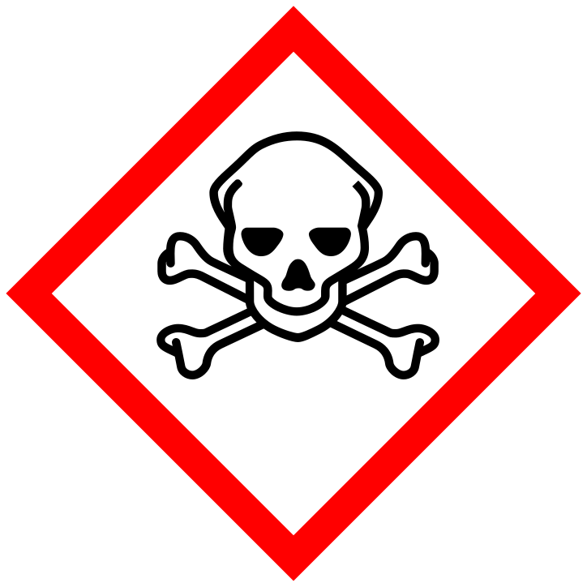{width="1.827380796150481in"
height="1.827380796150481in"}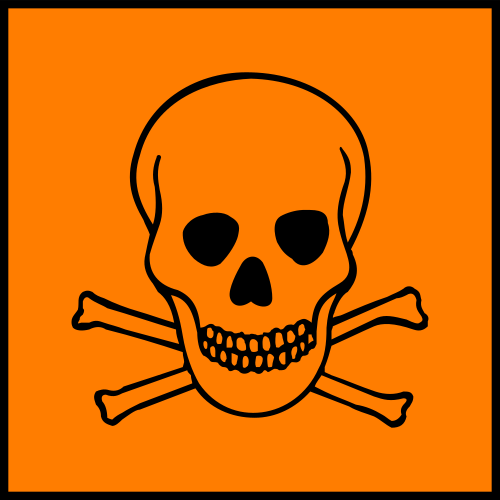{width="1.8551979440069992in"
height="1.8551979440069992in"}

Giftige Stoffe (T) können schon in geringer Konzentration zum Tod
führen. Gefahr besteht durch Einatmen, Verschlucken oder Aufnahme durch
die Haut.

Jeden Kontakt meiden! Nicht schlucken, nicht einatmen, nicht angreifen!

Bsp.: Blausäure, Quecksilber, Arsen, Chlor, Blei

***[Gesundheitsschädliche Stoffe (X~n~) (=mindergiftige
Stoffe):]{.underline}***

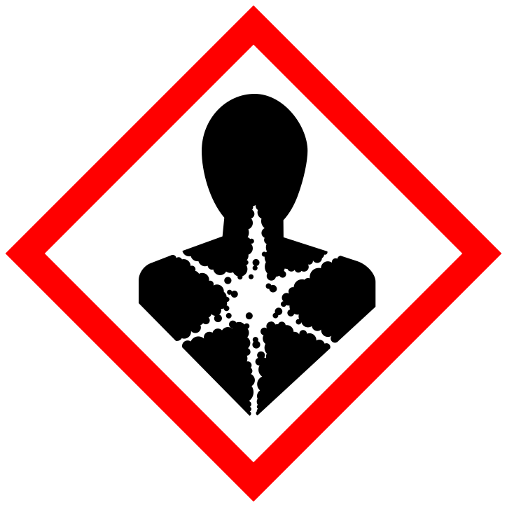{width="1.827380796150481in"
height="1.827380796150481in"}{width="1.8551979440069992in"
height="1.8551979440069992in"}

Gesundheitsschädliche Stoffe (X~n~) haben oft eine versteckte Wirkung.
Die Gefahr wird häufig unterschätzt. Gefahr besteht durch Einatmen,
Verschlucken oder Aufnahme durch die Haut.

Kontakt vermeiden beziehungsweise so kurz wie möglich halten! Bei
Verwendung Handschuhe tragen. Dämpfe nicht einatmen! Im Freien verwenden
oder gut lüften!

Bsp.: Jod, Terpentinöl, Chloroform, Glykol (Bestandteil von Liquids für
E-Zigaretten!), Kaliumpermanganat

***[Ätzende Stoffe (C):]{.underline}***

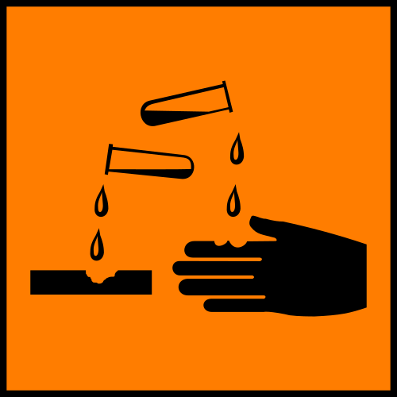{width="1.8551979440069992in"
height="1.8551979440069992in"}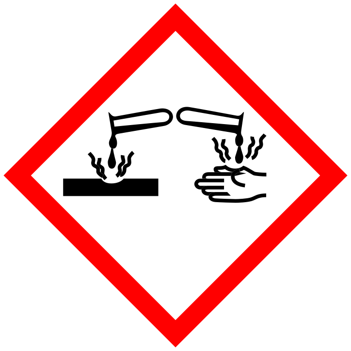{width="1.827380796150481in"
height="1.827380796150481in"}

Ätzende Stoffe (C) führen bei Hautkontakt zu Gewebe­­­­zerstörung. Die
gewebezerstörende Wirkung kann gefährliche Wunden verursachen. Das
Einatmen kann zu Reizungen der Atemwege sowie zu schweren
Lungenerkrankungen führen.

Jeden Kontakt meiden! Dämpfe nicht einatmen!

Schutzkleidung tragen! Im Freien verwenden oder gut lüften!

Bsp.: Säuren und Laugen

***[Reizend wirkende Stoffe (X~i~):]{.underline}***

{width="1.8551979440069992in"
height="1.8551979440069992in"}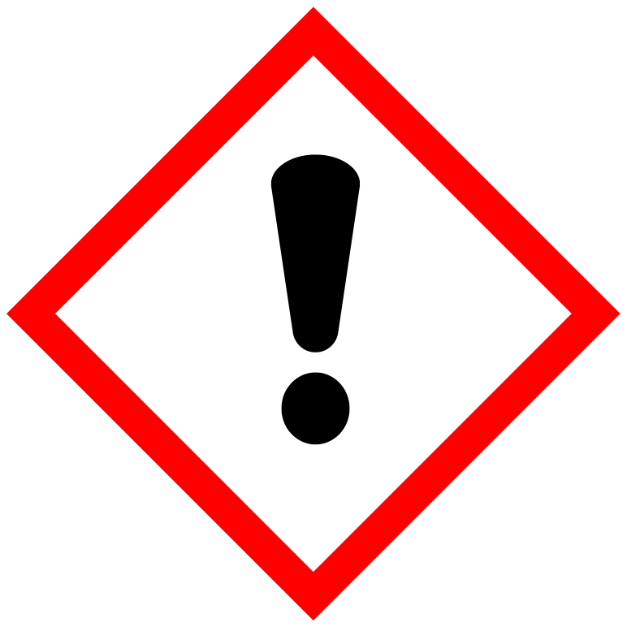{width="1.827380796150481in"
height="1.827380796150481in"}

Reizend wirkende Stoffe (X~i~) haben oft eine versteckte Wirkung. Die
Gefahr wird häufig unterschätzt. Die falsche Verwendung führt zu
Entzündungen.

Diese Stoffe dürfen nicht in Kontakt mit Augen oder Haut kommen.
Schutzkleidung tragen! Dämpfe nicht einatmen! Gut lüften oder im Freien
anwenden!

Bsp.: Verdünnte Säuren und Laugen, Lacke, Farben, Schimmelentferner,
Raumsprays, ätherische Öle

***[Brandfördernde Stoffe (O):]{.underline}***

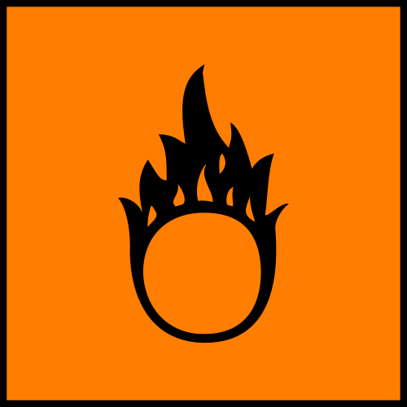{width="1.8551979440069992in"
height="1.8551979440069992in"}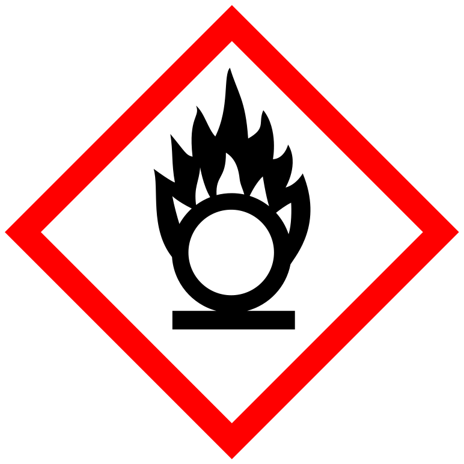{width="1.827380796150481in"
height="1.827380796150481in"}

Brandfördernde Stoffe (O) geben Sauerstoff ab und bewirken oder fördern
das Brennen entzündlicher Stoffe.

Nicht in der Nähe von Feuerstellen lagern. Bei Brand die Einsatzkräfte
sofort informieren!

Bsp.: Sauerstoff, sauerstoffreiche Verbindungen, Sauerstoff abgebende
Verbindungen (z. B. Kaliumpermanganat, Chlor­tabletten,
Wasserstoffperoxid)

***[Leicht entzündliche Stoffe (F):]{.underline}***

{width="1.8551979440069992in"
height="1.8551979440069992in"}

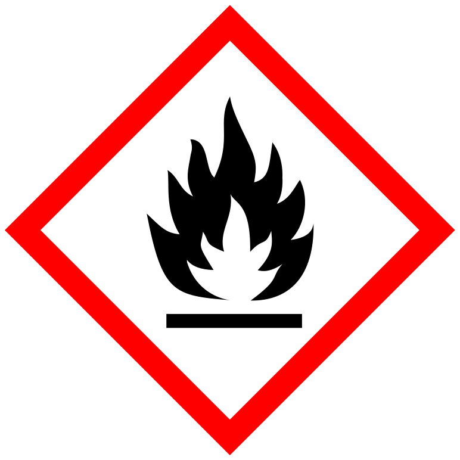{width="1.827380796150481in"
height="1.827380796150481in"}

Leicht entzündliche Stoffe (F) können schon bei Zimmer­temperatur
entweder sich selbst entzünden oder brennbare Dämpfe entwickeln.

Gefahr besteht durch Bildung explosiver Gemische mit Luft.

Nicht rauchen! Kein offenes Feuer! Keine Funken!

Bsp.: Aceton, Ethanol, Benzin, Heu, **Desinfektionsmittel**

## Explosionsgefährliche Stoffe (E):

{width="1.8551979440069992in"
height="1.8551979440069992in"}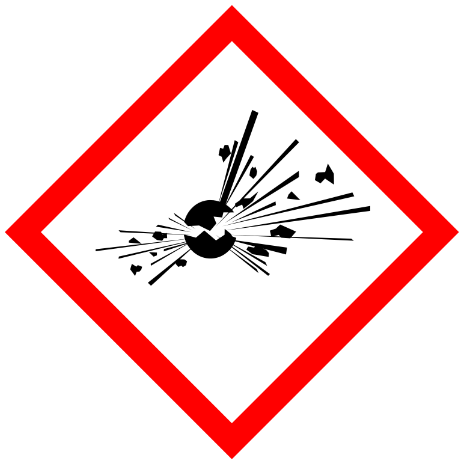{width="1.827380796150481in"
height="1.827380796150481in"}

Explosionsgefahr durch Reibung, Hitze, Schläge oder Stöße. Nicht
rauchen! Kein offenes Feuer! Keine Funken!

Bsp.: Sprengstoffe, Feuerwerkskörper, Nitroglycerin, Bleiazid

## Umweltgefährliche Stoffe (N):

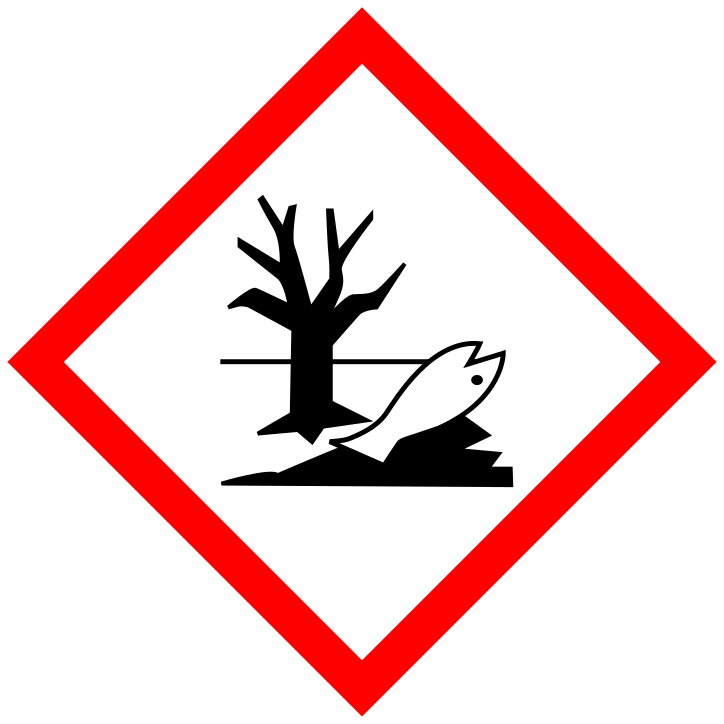{width="1.827380796150481in"
height="1.827380796150481in"}{width="1.854861111111111in"
height="1.854861111111111in"}

Produkt kann Umweltschäden herbeiführen! Gefahr für Menschen, Tiere,
Pflanzen.

Sparsame Verwendung! Bei diesen Stoffen ist vor allem auf die richtige
Entsorgung zu achten! Sondermüll!

Bsp.: Rasendünger, Schädlingsbekämpfungsmittel, Pilzbekämpfungsmittel,
Lösungsmittel, Desinfektionsmittel, Reinigungsmittel

## Gase unter Druck:

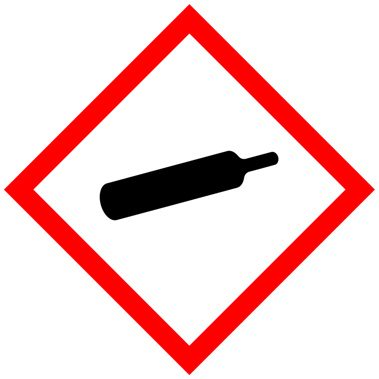{width="1.827380796150481in"
height="1.827380796150481in"}

Bei diesen Behältern besteht Explosionsgefahr durch Eindrücken des
Behälters oder Hitzeeinfluss!

Bsp.: CO~2~-Patronen zur Sodaherstellung

> Behälter mit gefährlichen Stoffen unterliegen der
> Kennzeichnungspflicht, das heißt sie müssen gekennzeichnet werden!!!

# Regeln für die Aufbewahrung und den Umgang mit Haushalts-Chemikalien

- Auf die Gefahrenzeichen achten!

- Produkte richtig verwenden, Beschreibungen auf der Etikette genau
  durchlesen

- Bei ätzenden und reizenden Stoffen Schutzkleidung verwenden
  (Handschuhe, Schutzmaske) oder im Freien benutzen

- außerhalb der Reichweite von Kleinkindern aufbewahren

- Werkstatt zusperren

- nicht im Lebensmittelschrank aufbewahren

- nicht in Lebensmittelbehälter umfüllen

- Fast alle Vergiftungsunfälle im Haushalt entstehen durch
  Verwechslungen, daher Aufbewahrungsorte sinnvoll wählen!

- unbekannte Chemikalien nicht kosten

- beim Riechen zufächeln

- Beim Umfüllen richtig beschriften und mit Gefahrenzeichen versehen!

- gut verschlossen aufbewahren

- beim Gebrauch von Chemikalien mit Dämpfen Räume gut lüften

- bei der Arbeit mit ätzenden Stoffen (Abflussreiniger, Abbeizmittel,
  Backofenreiniger ...) Spritzgefahr beachten → Schutzbrille tragen!

- kleinstmögliche Mengen verwenden

- feuergefährliche Stoffe vom offenen Feuer fernhalten

- feuergefährliche Stoffe nicht in die Sonne legen

- schlecht brennende Feuer (z.B. Öfen, Lagerfeuer, Griller) keinesfalls
  durch Nachschütten von brennbaren Flüssigkeiten

> (Benzin, Spiritus, ...) „in Schwung bringen" wollen! Explosionen und
> schwere Verbrennungen sind die Folge!

- Akkus richtig lagern und entsorgen

- richtige Entsorgung: Sondermüll!!

# Physikalische Trennverfahren

Um ein Gemenge in seine Bestandteile zu zerlegen, werden die
verschiedenen Eigenschaften der Reinstoffe ausgenützt:

## Unterschiedliche Dichte:

### Schlämmen: 

Schwere Teile sinken in Flüssigkeiten zu Boden, leichte schwimmen auf
dem Wasser.

[Versuch:]{.underline} Trennung von Eisen- und Schwefelpulver

[prakt. Bsp.:]{.underline} Kläranlage

### Zentrifugieren:

Die schwereren Teilchen werden mehr nach außen gedrückt.

[prakt. Bsp.:]{.underline} Honigschleuder, Salatschleuder,
Wäscheschleuder, Laborzentrifuge

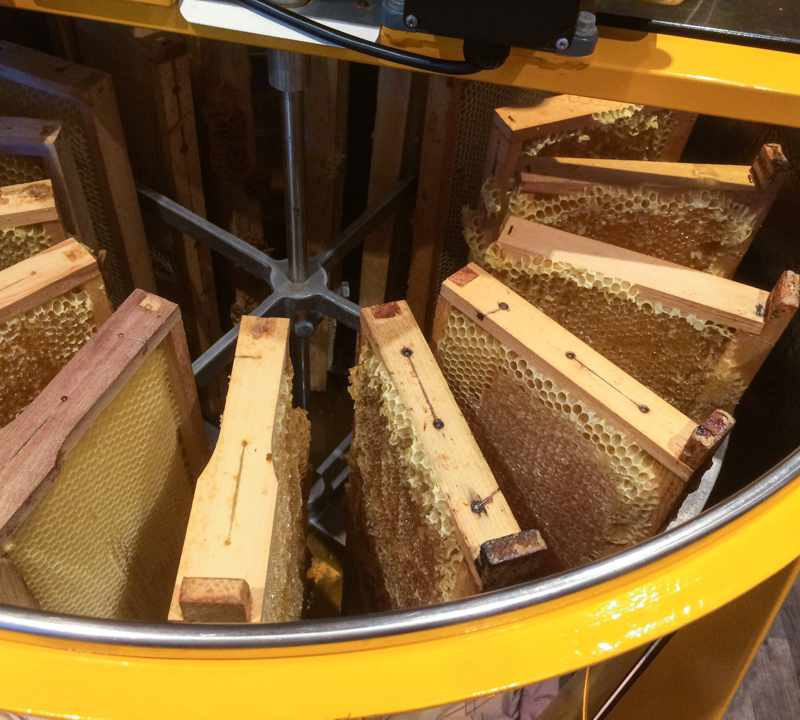{width="2.158333333333333in"
height="1.9402777777777778in"}{width="1.9701388888888889in"
height="1.9701388888888889in"}{width="2.029861111111111in"
height="2.029861111111111in"}

## Unterschiedliche Löslichkeit:

### Auflösen:

[Versuch:]{.underline} erwärmter Alkohol löst Blattgrün (=Chlorophyll)
aus den Blättern

[prakt. Bsp.:]{.underline} Salzgewinnung (Sole), Farbenherstellung

## Unterschiedlicher Siedepunkt:

### [Eindampfen]{.underline}:

[Versuch:]{.underline} Sole eindampfen

[prakt. Bsp.:]{.underline} Salzgewinnung (Sudhaus)

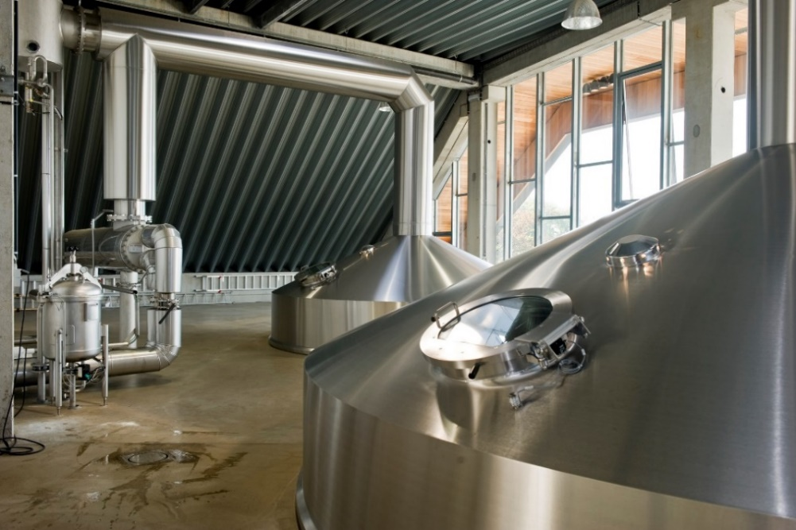{width="4.555448381452319in"
height="3.0328947944007in"}

### Destillation:

Verdampfen mit anschließendem Abkühlen nennt man Destillation.

[Versuch:]{.underline} Limonade destillieren

[prakt. Bsp.:]{.underline} Erdölverarbeitung, Herstellung von
destilliertem Wasser, Herstellung von Alkohol

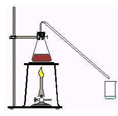{width="2.40625in" height="2.35625in"}

## Unterschiedliche Teilchengröße:

### Filtrieren:

Größere Teilchen bleiben zurück, feine Teilchen können durch den Filter
fließen.

[Versuche:]{.underline} Kaffeefilter und Aktivkohle

[prakt. Bsp.:]{.underline} Grundwasser

## Unterschiedliche Geschwindigkeit:

### Chromatographie:

Durch die Kapillarwirkung des Filterpapiers steigt das Wasser hoch und
löst die einzelnen Teilchen (Farben). Da die Farbanteile verschieden
schnell wandern, kann man sie einzeln sehen.

[Versuch:]{.underline} schwarzer Filzstift: grüne, violette, blaue usw.
Anteile

[prakt. Bsp.:]{.underline} Medizin und Lebensmittelchemie

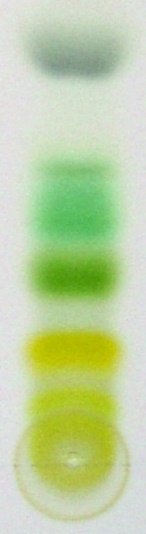{width="0.6641732283464566in"
height="2.426003937007874in"}

## Anziehung durch einen Magneten:

### Magnetische Trennung:

Eisen-, Nickel- oder Kobaltteilchen (in Pulverform) kann man mit einem
Magneten herauslösen.

[Versuch:]{.underline} Eisenpulver und Sand trennen.

[prakt. Bsp.:]{.underline} Medizin, Müllverarbeitung

# Reinstoffe und Gemenge (Gemische)

Ein Reinstoff *besteht aus einem einzigen Stoff*. Das kann eine
chemische Verbindung oder ein chemisches Element sein. Er hat eine
bestimmte Dichte, einen bestimmten Schmelzpunkt und einen bestimmten
Siedepunkt.

[Beispiele:]{.underline} Gold, Silber, Schwefel, Salz, Mehl, Wasser,
Eisen

Reinstoffe können mit einem physikalischen Trennverfahren nicht weiter
aufgeteilt werden. Sie werden durch chemische Verfahren zerlegt.

Ein Gemenge *ist eine Mischung von zwei oder mehreren Reinstoffen*. Wenn
man Reinstoffe zu einem Gemenge vermischt oder ein Gemenge in seine
Reinstoffe aufteilt, behalten diese Reinstoffe dabei ihre Eigenschaften.

[Beispiele:]{.underline} Glas, Legierungen, Seifenwasser, Luft, Cola,
Granit, Milch.

Das Gemenge Milch besteht aus Wasser, Eiweiß, Fett, Kohlenhydraten und
Vitaminen.

Gemenge können durch physikalische Verfahren zerlegt werden.

# 

# 

# Chemische Trennverfahren

Um eine Verbindung in ihre Bestandteile zu zerlegen, werden chemische
Trennverfahren angewendet.

***[Pyrolyse (Thermolyse)]{.underline}*** = Trennung durch Hitze

***[Elektrolyse]{.underline}*** = Trennung durch elektrischen Strom

Versuche:

Der Reinstoff Zucker kann physikalisch nicht weiter zerlegt werden. Beim
Erhitzen (Thermolyse) entstehen andere Stoffe: Kohlenstoff, Wasser und
brennbares Gas.

Wir erhitzen Kaliumpermanganat (KMnO~4~). Durch die Hitze wird KMnO~4~
in seine Bestandteile zerlegt: Braunstein und Sauerstoff. Der Sauerstoff
kann mit einem glimmenden Span nachgewiesen werden: dieser flammt hell
auf!

Wir lösen einen Löffel Kochsalz im Wasser auf und fügen der Lösung etwas
Phenolphtalein zu. Mit 2 Krokodilklemmen befestigt man 2 Kabel an den
Polen einer Flachbatterie. Taucht man die beiden Kabelenden in die
Salzlösung, so färbt sich die Flüssigkeit beim Kabel vom Minuspol pink.
Beim Minuspol entsteht Natronlauge; Phenolphtalein ist ein sehr
empfindlicher Indikator für Laugen (Basen). Beim Pluspol entsteht
Chlorgas (giftig).

# Indikatoren

# 

Indikatoren dienen zum Nachweis von Säuren und Laugen (Basen).

Versuchsreihe:

Testflüssigkeiten: Natronlauge, Essigsäure, Leitungswasser

### Überprüfung mit Lackmuslösung

Natronlauge: dunkelblau

Essigsäure: rot

Wasser: violett

### Überprüfung mit Universalindikatorpapier

Natronlauge: dunkelblau

Essigsäure: rot

Wasser: orange

### Überprüfung mit Phenolphtalein

Natronlauge: pink

Essigsäure: keine Verfärbung

Wasser: keine Verfärbung

### Überprüfung mit Rotkrautsaft

Natronlauge: grün bis gelb

Essigsäure: rosa bis rot

Wasser: violett

# Aufbau eines Atoms

Jedes Atom besteht aus einem Atomkern und einer Atomhülle.

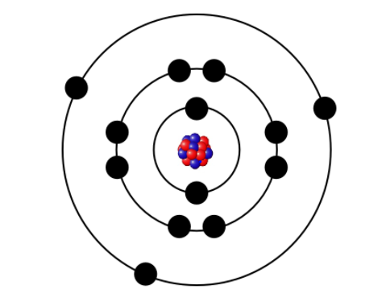{width="3.9351345144356955in"
height="3.0807425634295713in"}

Im Kern befinden sich die positiv geladenen Protonen und die neutralen
(ungeladenen) Neutronen.

In der Hülle befinden sich die negativ geladenen Elektronen.

Die Elektronen bewegen sich mit hoher Geschwindigkeit um den Kern. In
der Hülle befinden sich gleich viele Elektronen wie Protonen im Kern.

In der 1. Schale (K) schwirren bis zu 2 Elektronen.

In der 2. Schale (L) schwirren bis zu 8 Elektronen.

In der 3. Schale (M) schwirren bis zu 18 Elektronen.

Der Durchmesser der Hülle ist ca. 10 000 Mal so groß wie der Durchmesser
des Kerns.

Die Protonen im Kern werden durch die Kernkraft zusammengehalten.

# Die Arten der Atome

Die Art des Atoms wird durch die Anzahl der Protonen im Atomkern
festgelegt. Ein chemisches Element besteht aus gleichartigen Atomen,
genauer aus Atomen mit gleicher Protonenzahl. Alle Eisenatome haben
beispielsweise 26 Protonen, alle Goldatome 79 Protonen.

# Das Periodensystem der Elemente

{width="9.534722222222221in"
height="5.734764873140858in"}

Derzeit sind 118 verschiedene Elemente bekannt, die sich durch den
Aufbau ihrer Atome unterscheiden: Jedes Element hat eine bestimmte
Anzahl von Protonen.

Für die Entstehung von Verbindungen ist die Anzahl der Elektronen der
äußersten Schale (Außenelektronen bzw. Valenzelektronen) von großer
Bedeutung.

Im Periodensystem sind die Elemente nach steigender Protonenzahl
(Ordnungszahl) geordnet. Die Elemente werden zeilenweise angeschrieben,
jede Zeile beginnt mit einem Element dessen Atome nur 1 Außenelektron
haben. Dadurch entsteht ein Raster mit waagrechten Zeilen und
senkrechten Spalten.

***[Periode:]{.underline}*** Elemente mit gleicher Anzahl von Schalen
stehen in einer waagrechten Zeile (Periode). Es gibt 7 Perioden.

Bsp.: Ein Element der 3. Periode (3. Zeile) hat 3 Schalen.

***[Gruppe:]{.underline}*** Elemente einer senkrechten Spalte (Gruppe)
haben gleich viele Außenelektronen. Es gibt 8 Haupt- und 10
Nebengruppen. Elemente einer Gruppe haben ähnliche Eigenschaften.

Bsp.: Ein Element der 5. Hauptgruppe hat 5 Außenelektronen.

***[Alkalimetalle:]{.underline}*** nennt man die Elemente der 1.
Hauptgruppe. Die Metalle haben tiefe Schmelzpunkte, sie sind sehr weich

(z. B. Natrium und Kalium).

***[Halogene:]{.underline}*** heißen die Elemente der 7. Hauptgruppe.
Sie sind Nichtmetalle, verbinden sich „gerne" mit Metallatomen zu Salzen
(z. B. Na + Cl →NaCl = Kochsalz!). Sie färben die Flamme grün.

***[Edelgase:]{.underline}*** Das sind die Elemente der 8. Hauptgruppe.
Da sie 8 Außenelektronen haben, sind sie besonders stabil und können
sich daher kaum mit anderen Atomen verbinden.

[Ausnahme:]{.underline} Helium mit nur 1 Schale und daher nur 2
Außenelektronen.

Das Periodensystem

Die \...\...\... derzeit bekannten
\...\...\...\...\...\...\...\...\...\...\...\... sind im Periodensystem
nach der Zahl der Protonen geordnet
(\...\...\...\...\...\...\...\...\...\...\...\...\...\...zahl). Es
ergibt sich eine Einteilung in 7
\...\...\...\...\...\...\...\...\...\..... und 8
\...\...\...\...\...\...\...\...\...\...\...\...\...\...\...\...\...\...\...\...
und 10 Nebengruppen. Die Periode gibt an, wie viele

\...\...\...\...\...\...\...\...\...\...\... das Element hat. Die
Hauptgruppe gibt die Anzahl der
\...\...\...\...\...\...\...\...\...\...\...\..... in der äußersten
Schale an (Außenelektronen). In der äußersten Schale können maximal
\...\...\..... Elektronen sein - Ausnahme:
\...\...\...\...\...\...\...\...\...\...\.... und
\...\...\...\...\...\...\...\...\..... mit maximal 2 Elektronen, da sie
\...\...\...\...\...\...\...\...\...\...\...\...\...\...\...\...\...\...\...\...\...\...\.....
.

# Verbindungen

Für das chemische Verhalten der Stoffe ist die Anzahl der Elektronen der
äußersten Schale (Valenzelektronen) ent­scheidend. Alle Atome sind
bestrebt, ihre äußerste Schale zu vervollständigen und gehen deshalb mit
anderen Atomen Verbindungen ein.

Edelgase haben \"genügend\" Valenzelektronen und verbinden sich daher
nicht mit anderen Atomen.

## Die Atombindung (Elektronenpaarbindung)

Zwei Nichtmetalle verbinden sich. Die starken Anziehungs­kräfte zwischen
dem gemeinsamen Elektronenpaar und den Atomkernen ermöglichen den
Zusammenhalt des Moleküls.

## Die Ionenbindung

Wenn sich ein Metall mit einem Nichtmetall verbindet, ent­steht ein Salz.
Die Metallatome haben wenig Valenzelek­tronen und geben diese an das
Nichtmetallatom ab. Dadurch haben beide eine beständige Außenschale.
Durch das Abgeben und Aufnehmen von Elektronen entstehen Ionen (geladene
Atome). Aufgrund der unterschiedlichen Ladungen ziehen sich die Ionen an
und ordnen sich zu einem Kristallgitter.

## Die Metallbindung

Zwei Metalle verbinden sich. Metalle erreichen ihren stabilen
Edelgaszustand, indem sie die Valenzelektronen abgeben. Dadurch gibt es
in einem Metall immer Metallrümpfe (Ionen) und frei bewegliche
Elektronen (\"Elektronengas\"). So erklärt sich die gute Leitfähigkeit
für Wärme und Elektrizität.

### Metalle als elektrische Leiter

### 

Metalle haben in der Regel nur wenig Außenelektronen
(=Valenzelektronen), daher neigen sie zur Abgabe dieser Elektronen der
äußersten Schale.

Wenn ein Atom Elektronen abgibt, wird es zu einem positiv geladenen ION.
Die positiven Metall-Ionen sind an festen Plätzen regelmäßig angeordnet
und bilden ein Raum- oder Kristallgitter. Zwischen den Metall-Ionen
befinden sich die abgelösten Außenelektronen. Sie bilden das sogenannte
„Elektronen-Gas" und sind innerhalb des Metallkörpers frei beweglich.

Wird eine Spannungsquelle (z.B. Flachbatterie) angeschlossen:

Der Pluspol der Batterie hat Elektronenmangel, der Minuspol
Elektronenüberschuss. Die sich gegenseitig abstoßenden Elektronen am
Minuspol drängen die freien Elektronen im Draht in Richtung Pluspol. Von
diesem werden die Elektronen gleichzeitig angezogen. Die Geschwindigkeit
der Elektronen (e^-^) beträgt 1 mm pro Sekunde zum positiven Pol. Da
sich alle Elektronen im Draht gleichzeitig in Bewegung setzen, leuchtet
eine im Stromkreis liegende Lampe sofort auf (Modell: ein mit Kugeln
gefülltes Rohr: Sobald man an einem Ende eine weitere Kugel
hineinsteckt, fällt am anderen Ende bereits eine heraus.).

# Wasser

Ca. 2/3 der Erde sind mit Wasser bedeckt. Von unserem Wasservorkommen
sind jedoch nur ca. 2,7 % Süßwasser und von diesem Süßwasser ist nur
1/10 Trinkwasser! Trinkwasser ist also ein kostbares Gut, das nicht
unbegrenzt verfügbar ist!

## Der Wasserkreislauf

Alles Wasser auf unserem Planeten ist in einem ständigen Kreislauf, der
von der Sonne als Energiequelle angetrieben wird. Wasser verdunstet an
der Oberfläche der Meere und Kontinente in großen Mengen. Der
aufsteigende Wasserdampf kühlt in höheren Luftschichten ab und
kondensiert dort zu Wolken, die bei weiterer Abkühlung ihre Feuchtigkeit
als Regen, Hagel oder Schnee wieder abgeben.

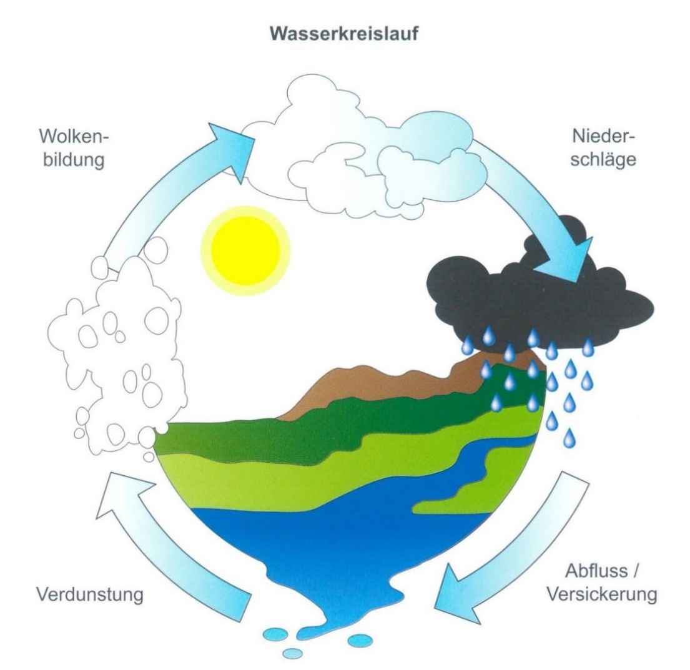{width="5.026345144356956in"
height="4.8815791776027995in"}

## Wasser als Lebenselixier

### Die Aufgaben des Wassers im Körper:

- Lösungsmittel: Wasser löst die festen Bestandteile der Nahrung und
  transportiert die gelösten Nährstoffe zu den Zellen

- Transportmittel für Stoffwechsel- und Ausscheidungsprozesse

- Temperaturregler: Wasser ist das Kühlmittel des Körpers. Bei großer
  Hitze oder Sport verhindert Schwitzen, dass die Körpertemperatur
  ansteigt. Der Schweiß verdunstet, dabei wird Wärme frei und die Haut
  kühlt ab.

- Druckausgleich zwischen Zellen und Gewebe

- Quellmittel im Verdauungstrakt: Wasser lässt Ballaststoffe quellen.

- Abtransport der Endprodukte des Stoffwechsels

- Hauptbestandteil des Blutes, der Tränen, der Lymphflüssigkeit, der
  Verdauungssäfte, Zellen und des Gewebes

- Befeuchtung der Lunge und der Atemwege

- Polsterung der Gelenke und der inneren Organe

- Schutz für das Ungeborene während der Schwangerschaft

Der Flüssigkeitshaushalt muss regelmäßig aufgefüllt werden, damit die
lebensnotwendigen Stoffwechselvorgänge uneingeschränkt ablaufen können.
Über Nahrungsaufnahme und Getränke kann der Bedarf gedeckt werden.

Ohne Flüssigkeit könnten wir nur ca. 3 Tage überleben.

Die Wasserverluste treten nicht unmittelbar nach dem Auftreten des
Flüssigkeitsverlustes, sondern am stärksten am Folgetag auf. Es bringt
nichts, am Abend mehr zu trinken, um die Verluste des Tages
auszugleichen. Wichtig ist eine ausgewogene Flüssigkeitszufuhr von 2 bis
3 Liter die sich über den ganzen Tag verteilt.

### Wasser und Leben

Wassergehalt von Organismen:

(Angaben in % des Gesamtgewichtes)

Quallen, Algen 94 %

Blätter (höhere Pflanzen) 85 %

Gurke 95 %

Weinbergschnecke 85 %

Fische 80 %

Frosch 77 %

Schwein 55 %

Holz 50 %

Vögel 72 %

Insekten 50 - 80 %

Regenwurm 80 %

trockene Samen 14 %

## Wasser chemisch betrachtet

Wasser ist aus Molekülen aufgebaut, wobei jedes Wassermolekül aus 2
Atomen Wasserstoff und 1 Atom Sauerstoff besteht, die durch
Elektronenpaarbindung (Atombindung) miteinander verbunden sind. Ein
Molekül ist die kleinste Einheit einer Verbindung.

Das Wassermolekül ist gewinkelt und es kommt zur Bildung eines DIPOLS,
das bedeutet eines positiven Poles zwischen den Wasserstoffatomen und
eines negativen Poles beim Sauerstoffatom.

{width="3.3997353455818025in"
height="2.1726192038495187in"}

## Darstellungsmöglichkeiten für das Wassermolekül

### Elektronenformel 

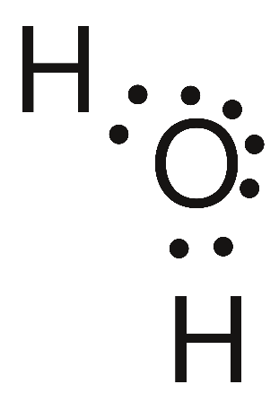{width="1.410715223097113in"
height="1.987049431321085in"}

### Valenzstrichformel (Strukturformel)

{width="1.4290583989501313in"
height="1.886903980752406in"}

### Keilstrichformel (Strukturformel) 

{width="2.3333333333333335in"
height="1.1657917760279966in"}

### Kalottenmodell

{width="2.3117694663167105in"
height="1.6644728783902012in"}

### Summenformel

H~2~O

## Hofmann'scher Wasserzersetzungsapparat

{width="2.204861111111111in"
height="5.065972222222222in"}

Der Hofmann'sche Zersetzungsapparat wird mit Wasser gefüllt, das zur
Er­höhung der elektrischen Leitfähigkeit mit etwas Schwefelsäure
angereichert worden ist.

Werden die beiden Elektroden mit einer Gleichstromquelle verbunden, kann
man beobachten, wie in beiden Röhren der Flüssigkeitsspiegel sinkt, da
die Flüssigkeit durch die sich bildenden Gase verdrängt wird. Über dem
Minuspol entsteht doppelt so viel Wasserstoff wie Sauerstoff über dem
Pluspol.

*[Sauerstoffnachweis:]{.underline}* Ein glimmender Span flammt hell auf!

*[Wasserstoffnachweis:]{.underline}* H~2~ verbrennt mit einem Pfeifton!

Wasserstoff und Sauerstoff bilden eine gefährliche Gasmischung, das
sogenannte Knallgas. Nach dem Entzünden verbrennt der Wasserstoff
explosionsartig zu Wasser. Das gefährlichste Mischungsverhältnis ist H :
O = 2 : 1. Nur so bleibt bei der Bildung von Wasser kein
Reaktionspartner unverbraucht zurück. Jeweils zwei H-Atome verbinden
sich mit einem O-Atom.

*[Endotherme Reaktionen:]{.underline}* Reaktionen, die Energie
benötigen.

*[Exotherme Reaktionen:]{.underline}* Reaktionen, bei denen Energie frei
wird.

*[Oxidation:]{.underline}* Reaktion, bei der eine Sauerstoffverbindung
entsteht.

Bsp. Knallgasreaktion: 2H~2~ + O~2~ → 2H~2~O

*[Reduktion:]{.underline}* Vorgang, bei dem einer Verbindung der
Sauerstoff entzogen wird.

Bsp. Elektrolyse: 2H~2~O → 2H~2~ + O~2~

## Wasser als Lösungsmittel

### Für Feststoffe:

Bsp.: Wasser ist ein Lösungsmittel für Kochsalz (NaCl). Die
ungleichnamigen Pole des Wassermoleküls lösen die Na^+^-Ionen und die
Cl^-^-Ionen aus dem Kristallverband und umhüllen sie.

{width="6.148610017497813in"
height="3.071527777777778in"}

Dieser Lösungsvorgang kann durch Erwärmen, Zerkleinern, Umrühren oder
Schütteln beschleunigt werden.

Ein Lösungsmittel kann aber nur eine bestimmte Menge eines Stoffes
aufnehmen, dann spricht man von einer gesättigten Lösung und der Stoff
(z. B. Kochsalz) setzt sich im Gefäß ab. Die Sättigung ist von der
Temperatur abhängig:

Je wärmer die Flüssigkeit, desto mehr Feststoffe können gelöst werden.

### Für Flüssigkeiten:

Flüssigkeiten, die wasserlöslich sind, entmischen sich nach dem Umrühren
nicht mehr. Bei Flüssigkeiten, die sich mit Wasser nicht oder schlecht
mischen, kommt es nach dem Umrühren zu einer Entmischung. Z. B. Öl
bildet eine Schicht auf der Wasseroberfläche.

In einer Emulsion ist eine wasserunlösliche Flüssigkeit in feinsten
Tröpfchen im Wasser verteilt.

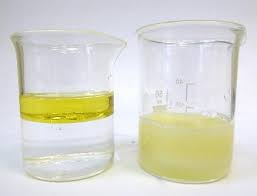{width="3.2465748031496062in"
height="2.4747036307961503in"}

### Für Gase:

Sauerstoff und Kohlendioxid sind meist im Wasser in gelöster Form
enthalten. Wenn die Temperatur steigt bzw. der Druck abnimmt, nimmt die
Lösungsfähigkeit des Wassers für Gase ab:

Je höher die Temperatur des Wassers, desto weniger Gase können gelöst
werden.

Je höher der Druck, desto mehr Gase können gelöst werden.

Versuch:

Verdampfen von destilliertem H~2~O, Leitungswasser und Mineralwasser.

*Erkenntnis:*

destilliertes H~2~O: kein Rückstand

Leitungswasser: leichter weißer Rand (Kalk, \...)

Mineralwasser: dicker weißer Rand

> (Mineralstoffe, Kalk, Salze)

## Anomalie des H~2~O

H~2~O hat bei +4°C die größte Dichte. Daher schwimmt Eis auf dem Wasser.

{width="4.041666666666667in"
height="1.7680555555555555in"}

Ein See friert nicht vollständig zu. Am Grund sammelt sich das
\"schwerste\" Wasser mit 4°C.

Wichtig für die Fische!

## Wasserhärte

Weiches H~2~O: \"kalkarmes Wasser\" hat wenig Calciumhydrogencarbonat =
Ca(HCO~3~)~2~ gelöst.

Hartes H~2~O: \"kalkreiches Wasser\" hat viel Ca(HCO~3~)~2~ gelöst.

## Tropfsteine

Beim Verdunsten von hartem H~2~O können Kesselsteine oder Tropfsteine
entstehen.

{width="3.154877515310586in"
height="2.100825678040245in"}{width="3.122648731408574in"
height="2.0823895450568677in"}

Stalaktiten Stalagmiten

{width="3.35996719160105in"
height="2.3392858705161856in"}{width="2.809523184601925in"
height="2.3387707786526684in"}

Kesselstein

### Kalklösen

Wasser + Kohlendioxid + Kalk → gelöstes Calciumhydrogencarbonat

H~2~O + CO~2~ + CaCO~3~ → Ca(HCO~3~)~2~

### Tropfsteinbildung

gelöstes Calciumhydrogencarbonat → Wasser + Kohlendioxid + Kalk

Ca(HCO~3~)~2~ → H~2~O + CO~2~ + CaCO~3~

# Die Luft

Bis zum Ende des 18. Jahrhunderts wurde Luft für einen reinen Stoff
gehalten, heute weiß man aber, dass Luft eine Gasmischung ist:

78 % Stickstoff

21 % Sauerstoff

1 % Edelgase, Kohlendioxid und Wasserdampf

## Stickstoff 

- reaktionsträge

- bildet Moleküle mit 2 Atomen (N~2~)

- erstickt Flammen

- ist selbst nicht brennbar

- Ausgangsstoff zur Herstellung von Düngern, Salpetersäure, Kunststoffen
  usw.

- im Handel in grünen Flaschen erhältlich

[Versuch:]{.underline} Über eine brennende Kerze werden verschieden
große Gläser gestülpt.

{width="4.061970691163604in"
height="3.0476192038495187in"}

Erkenntnis: Die Flamme erstickt, nachdem der Sauerstoff verbraucht
wurde.

(Je größer das Glas, desto länger brennt die Kerze.)

Versuch:

{width="2.7442924321959756in"
height="2.7442924321959756in"}

Nachdem der Sauerstoff verbraucht wurde, steigt das Wasser im
Standzylinder.

## Sauerstoff

- reaktionsfreudig

- bildet Moleküle mit 2 Atomen (O~2~)

- lebensnotwendig (Atmung)

- für die Verbrennung notwendig

- das häufigste Element der Erdrinde

- Bestandteil vieler organischer Verbindungen und aller Gesteine

- Verwendung: Stahlerzeugung, Schneiden und Schweißen von Metallen,
  Atmungsgeräte, Raketenantrieb usw.

- im Handel in blauen Stahlflaschen erhältlich

### Oxidation

Bei einer Oxidation verbindet sich ein Stoff mit Sauerstoff. Es
entstehen sogenannte Oxide.

Die Verbrennung ist ein Beispiel für eine schnelle Oxidation, das Rosten
von Eisen geht sehr langsam vor sich. Auch die Atmung ist eine Oxidation
(in den Körperzellen).

## Edelgase

Die Edelgase Helium (He), Neon (Ne), Argon (Ar), Krypton (Kr), Xenon
(Xe) und Radon (Rn) wurden erst nach der Aufstellung des Periodensystems
knapp vor Beginn des 20. Jahrhunderts entdeckt. Ihr Gesamtanteil an der
Luft beträgt 1 %, wobei das Edelgas Argon am stärksten vertreten ist.
Die Edelgase sind farb- und geruchlos. Da sie 8 Außenelektronen besitzen
(Ausnahme: Helium mit 2), kommen sie in der Luft in Form einzelner Atome
vor.

### Technische Verwendung der Edelgase

**Helium:**

Füllung von Ballons und Luftschiffen, Antrieb für Pumpen bei
Raketenmotoren, Füllung von Kühlanlagen in Kernkraftwerken,
Asthmatherapie, in Pressluftflaschen für Taucher als Stickstoffersatz,
Leckdetektoren

**Neon:**

Füllung von Leuchtreklameröhren, rötliches Licht, Scheinwerfer, Laser,
Spannungsprüfer

**Argon:**

Füllung von Glühlampen und Leuchtstoffröhren, Schutzgas beim
elektrischen Schweißen zur Verhinderung einer Oxidation

**Krypton:**

Füllung von Glühlampen, verhindert das Verdampfen der Glühwendel und
bewirkt die lange Lebensdauer der Lampe, Blitzbirnen, UV-Laser

**Xenon:**

Hochdruckglühlampen mit starker Leuchtkraft für Bühnenscheinwerfer und
Flutlichtanlagen, UV-Lampen, Solarien, Projektionslampen

**Radon:**

liefert radioaktive Strahlen zur Krebsbehandlung, Erdbebenvorhersage

{width="2.6911253280839893in"
height="2.1404582239720034in"}{width="3.1931933508311463in"
height="2.122736220472441in"}

***[[\]{.underline}
]{.smallcaps}***

# Schadstoffe in der Luft

Auch ohne menschliches Zutun gab es schon immer \"Fremdstoffe\" in der
Luft (z.B. durch Waldbrände, Vulkanausbrüche und Explosionen).

Durch den Menschen und die Technisierung gelangen mehr Schadstoffe in
die Luft.

## Kohlendioxid (CO~2~)

*[Entstehung]{.underline}*

CO~2~ entsteht bei der Verbrennung kohlenstoffhältiger Brenn- und
Treibstoffe, bei der Atmung, der Gärung und der Verwesung.

*[Eigenschaften]{.underline}*

CO~2~ ist ein farb- und geruchloses Gas. Es brennt nicht, erstickt
Flammen und ist schwerer als Luft. Es trübt klares Kalkwasser.

CO~2~ ist ungiftig, aber stark CO~2~-hältige Luft bewirkt Kopfschmerzen,
Müdigkeit, Bewusstlosigkeit und schließlich Erstickungstod durch
Sauerstoffmangel.

CO~2~ ist auch im Sodawasser enthalten, teils gelöst, teils zu
\"Kohlensäure\" gebunden.

CO~2~ + H~2~O → H~2~CO~3~

Außerdem führt stark CO~2~-hältige Luft zu einer Verstärkung des
Treibhauseffektes.

## Treibhauseffekt

{width="6.399305555555555in"
height="2.723482064741907in"}

Die Atmosphäre wird von der Sonnenstrahlung durchbrochen.

Verbrennung, Abgase, Treibgase reichern die Atmosphäre mit Kohlendioxid
und Spurengasen an. Die Sonnenstrahlung erwärmt die Erde. Die erwärmte
Erde sendet die langwellige Wärmestrahlung aus. Kohlendioxid und
Spurengase werfen verstärkt diese langwellige Wärmestrahlung zurück.

Treibhauseffekt: Die Temperatur auf der Erde erhöht sich.

**Gefahren:** Ausdehnung der Wüsten, Schmelzen des Polareises,
Meeresspiegel steigt, Klimaveränderung.

## Kohlenmonoxid (CO)

*[Entstehung]{.underline}*

CO entsteht bei der Verbrennung von kohlenstoffhaltigen Stoffen unter
Sauerstoffmangel. Es kommt daher in Auspuffgasen von Kraftfahrzeugen, im
\"Kohlendunst\" schlecht ziehender Öfen und im Zigarettenrauch vor.

*[Eigenschaften]{.underline}*

CO ist ein farb- und geruchloses, sehr giftiges Gas. CO wird vom
Hämoglobin des Blutes fester gebunden als Sauerstoff und blockiert daher
den Sauerstofftransport. CO verbrennt mit bläulicher Flamme zu CO~2~.

## Stickstoffoxide (NO~x~)

NO~x~ steht meist für die Stickstoff-Sauerstoffverbindungen NO und
NO~2~.

## Stickstoffmonoxid (NO)

*[Entstehung:]{.underline}* NO entsteht bei der Verbrennung unter hohen
Temperaturen in Kraftfahrzeug- und Flugzeugmotoren, in
Großfeuerungsanlagen, bei Gewittern und beim Zigarettenrauchen.

*[Eigenschaften:]{.underline}* NO ist ein farbloses, in Wasser
unlösliches Gas, das die Schleimhäute der Atmungsorgane angreift und im
Blut ähnlich wie CO wirkt.

## Smog (smoke + fog)

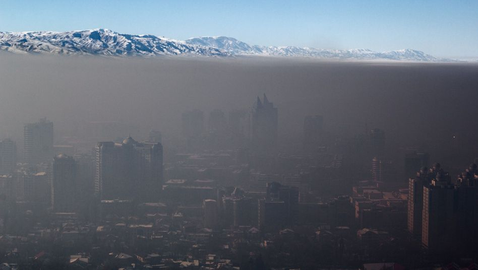{width="6.08333552055993in"
height="3.4395220909886266in"}

{width="6.074074803149606in"
height="3.4166666666666665in"}

Smog entsteht in verkehrsreichen Großstädten. Aus NO~x~ entsteht durch
Oxidation im Sonnenlicht das Ozon (O~3~).

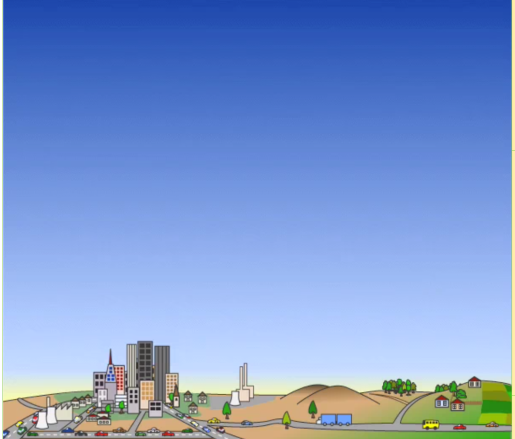{width="5.148611111111111in"
height="2.233565179352581in"}

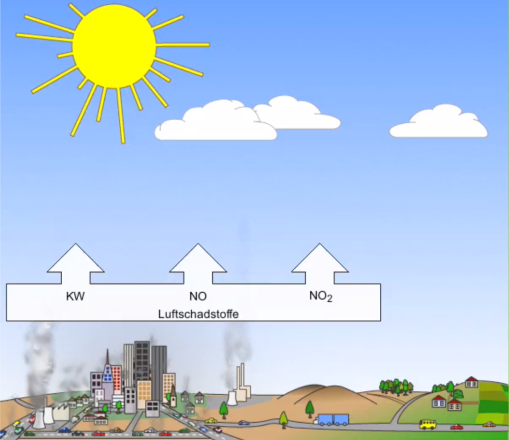{width="4.4631944444444445in"
height="3.8583333333333334in"}Sommer-Smog entsteht in Großstädten mit
hoher Verkehrs­dichte bei starker Sonneneinstrahlung und niedriger
Wind­geschwindigkeit. Stickstoffoxide (NO, NO~2~, oder allgemein NO~x~)
und Kohlenwasserstoffe (KW) sind die Schlüssel­substanzen.\
Diese Luftschadstoffe gelangen mit den Abgasen von Verkehr und Industrie
und durch Verbrennung fossiler Brennstoffe in Privathaushalten in die
Stadtatmosphäre. Bereits vor Sonnenaufgang wird die Stadtluft damit
angereichert.

Nach Sonnenaufgang kommt es an warmen Sommertagen bei starker
UV-Einstrahlung zur Zersetzung des NO~2~. Dabei entsteht
reaktionsfreudiger, atomarer Sauerstoff (O), der mit den
Sauerstoffteilchen der Luft (O~2~) zu giftigem Ozon (O~3~) reagiert.
Ozon schädigt in erhöhter Konzentration die Atmungsorgane. Smog-Alarm
wird bei Werten über 180µg/m^3^ Luft ausgelöst.\
Auch die Kohlenwasserstoffe (KW) reagieren mit atomarem Sauerstoff. So
wird die Ozonbildung weiter verstärkt.\
Mit der städtischen Abluftfahne wird dieses Ozon durch den Wind ins
Umland transportiert. In Waldgebieten werden die Blätter der
Kronenschicht geschädigt. Auf diese Weise trägt das bodennahe Ozon auch
zum Phänomen des \"Waldsterbens\" bei.

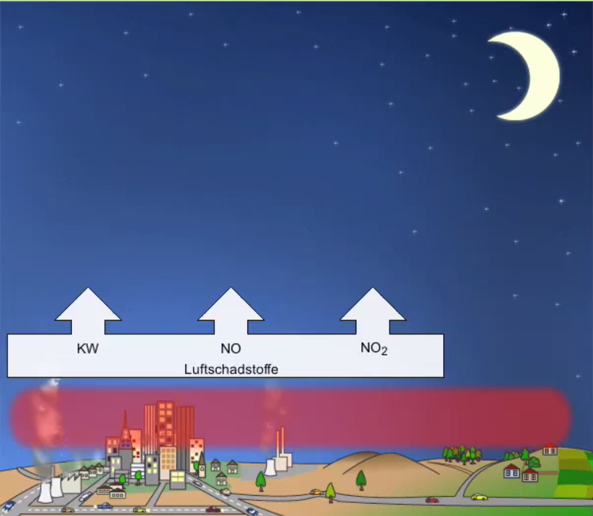{width="4.081944444444445in"
height="3.5541666666666667in"}

Nimmt die Sonneneinstrahlung ab, so unterbleibt die Zer­setzung von
NO~2~. Damit entfällt die Nachlieferung von NO für die Ozonsynthese.
Ohne UV-Licht, nachts, fördern Stick­stoffoxide den Ozonabbau.\
In den Reinluftgebieten des Umlands findet dieser Ozonabbau wegen der
fehlenden Luftschadstoffe nicht in dem Maße statt, sodass dort morgens,
nachts und abends sogar höhere Ozonwerte als in der Stadt vorliegen
können.

## Ozon

Ozon (O~3~) schädigt Atemwege und Pflanzen. Es ist ein Schadstoff, der
als solcher kaum emittiert (ausgestoßen) wird, er entsteht aus
Stickstoffoxiden, flüchtigen organischen Verbindungen oder Kohlenmonoxid
unter dem Einfluss von ultraviolettem Licht. Der Mensch reagiert bereits
auf kurzfristige Belastungen sehr empfindlich. Österreich ist in
Ozonregionen eingeteilt. Im Bedarfsfall wird die betroffene Bevölkerung
über Radio informiert.

### Ozon-Vorwarung 

Empfindliche und Kranke sollten starke Anstrengungen im Freien
vermeiden.

*[Ozon-Warnstufe 1]{.underline}*

Auch gesunde Menschen sollten Anstrengungen im Freien vermeiden, von der
Durchführung von Schulwandertagen und Schulsportveranstaltungen wird
abgeraten.

*[Ozon-Warnstufe 2]{.underline}*

Es wird der Bevölkerung empfohlen sich bevorzugt in Innenräumen
aufzuhalten, sämtliche Schulveranstaltungen im Freien sind verboten!

*[Entstehung]{.underline}*

Schwefeldioxid entsteht bei der Verbrennung schwefelhaltiger Brenn- und
Kraftstoffe und ist in Vulkangasen enthalten.

*[Eigenschaften]{.underline}*

SO~2~ ist ein farbloses, schweres und stechend riechendes Gas. Es wirkt
bleichend und keimtötend. SO~2~ verursacht Hustenreiz und wirkt
schädigend auf die Atemwege. Es ist nicht brennbar und löst sich sehr
leicht im Wasser (→ Saurer Regen).

## 

***[Chlorwasserstoffgas]{.underline}*** entsteht bei der Verbrennung von
PVC.

***[Fluorwasserstoffgas]{.underline}*** wird vor allem von Ziegeleien,
Keramik- und Emailwerken, sowie von Aluminium- und Stahlwerken
abgegeben. Schädigend für Wälder und Gebäude.

***[Ammoniakgas]{.underline}*** entsteht bei der Massentierhaltung und
ist Bestandteil mancher Industrieabgase. Pflanzenschädigend.

***[Halogenierte Kohlenwasserstoffe]{.underline}*** (FCKW)

als Treibgas, Kühlmittel, Lösungsmittel in der Putzerei und als Pestizid
(Mittel gegen Pilze) verwendet.

***[Staub]{.underline}*** kann gesundheitsschädliche
Schwermetallteilchen, Mineralstoffe und Kohlenwasserstoffe enthalten.

***[Blei]{.underline}*** wird in den Knochen angereichert.

***[Quecksilber und Cadmium]{.underline}*** werden in
Müllverbrennungs­anlagen ausgestoßen. Sammeln sich im menschlichen Körper
an.

# Lebensmittelchemie

# Papierherstellung

Wir haben verschiedene Papierarten hergestellt. Die Grundstoffe waren
Stroh, Heu oder Laub.

Das Stroh (Laub, Heu) wird in 2 bis 5 cm lange Stücke geschnitten und
über Nacht in Wasser eingeweicht.

Am nächsten Tag wird das Stroh 1 Stunde ge-kocht. Pro Liter Wasser geben
wir 20 g Soda dazu. Das Soda löst das Lignin heraus und übrig bleibt die
Zellulose.

Der Strohbrei wird in einem Sieb abgefiltert

und mit frischem Wasser durchgespült, damit nichtfaserige Pflanzenteile
und das Soda aus-gewaschen werden.

Nun wird der Brei gemixt, mit etwas Kaolin und Leim versehen und
geschöpft.

Im Schöpfrahmen werden die festen von den flüssigen Bestandteilen
getrennt.

Der Basisrahmen dient als Träger des Siebes, der Abdeckrahmen hat die
Aufgabe, das seitliche Wegfließen des Papierbreies zu verhindern und
einen einigermaßen regelmäßigen Rand zu ge-währen.

Beim Gautschen wird das Papier vom Sieb gelöst und auf die Gautschtücher
gelegt. Wir haben unsere Blätter mit gepressten Pflanzen ge-schmückt.
Ein Schwamm kann dabei behilflich sein, die überschüssige Flüssigkeit
aufzusaugen.

In der Presse werden die Fasern des Papiergutes verdichtet und der
Wasserentzug beschleunigt. Zum Glätten haben wir das Papier gebügelt

Stroh

Heu

Laub

**[Säuren:]{.underline}**

\* Kohlensäure H~2~CO~3~

\- schwache Säure

\- unbeständig (entweicht als CO***~2~***)

***[\* Schwefelsäure H~2~SO~4~]{.underline}***

\- starke Säure

\- konzentrierte Schwefelsäure entzieht -

organischen Stoffen so heftig Wasser, dass

sie verkohlen

\- wird Schwefelsäure mit H***~2~***O vermengt,

erwärmt sie sich sehr stark (Gefahr

Verätzung!)

***[\* Salzsäure HCl]{.underline}***

\- starke Säure

\- raucht an der Luft (Säuregas entweicht)

\- löst unedle Metalle auf

\- Verwendung: Ätzen und Reinigen von

Metallen, Entkalken von Leitungen,

Herstellung von Reinigungsmitteln

\- verdünnt im Magensaft enthalten

***[Salpetersäure HNO~3~]{.underline}***

\- starke Säure

\- Gemenge von konzentrierter Salpetersäure

und konzentrierter Salzsäure im Verhältnis

1:3 heißt Königswasser. Diese Mischung löst

sogar Gold und Platin auf

\- färbt Eiweißverbindungen gelb

\- Verwendung: Düngemittel, Medikamente,

Farbstoffe, Sprengstoffe, Kunststoffe,

Insektizide

**[Basen:]{.underline}**

***[\* Natronlauge NaOH]{.underline}***

\- fühlt sich mit H~2~O vermengt glitschig an

(oberste Hautschicht wird zersetzt)

***[\* Calciumhydroxid Ca(OH)~2~]{.underline}***

\- = Löschkalk

\- mit H~2~O und Sand vermengt = Kalkmörtel

\- in H~2~O gelöst = Kalkmilch

\- Verwendung: Desinfizieren („Kalken" von

Ställen und Kellern), Baumstämme kalken als

Schutz vor Schädlingen

***[\* Ammoniak NH~3~]{.underline}***

\- farblos

\- stechend riechend

\- löst sich gut in H~2~O

\- in H~2~O gelöst Salmiakgeist genannt

\- Verwendung: Medizin, Textilindustrie,

Farbstoffe, Papiererzeugung,

Reinigungsmittel, Fleckentferner

**[Salze:]{.underline}**

\- Säuren und Basen bilden Salze

\- Säuren und Metalle bilden Salze

Salze der Salzsäure: Chloride

Salze der Kohlensäure: Carbonate

Salze der Salpetersäure: Nitrate

Salze der Schwefelsäure: Sulfate

Salze der Phosphorsäure: Phosphate

***[\* Natriumchlorid NaCl (Kochsalz):]{.underline}***

\- Medizin

\- Lebensmittel

\- Viehsalz

\- Streusalz

\- Ausgangsstoff für wichtige Chemikalien

***[\* Natriumcarbonat Na~2~CO~3~ (Soda):]{.underline}***

\- Bestandteil vieler Waschmittel

\- Glasherstellung

***[\* Calciumcarbonat CaCO~3~ (Kalkstein):]{.underline}***

\- Marmor und Kreide

\- Tropfsteinhöhlen

\- Schneckengehäuse

\- Muschelschalen

\- Gräten und Knochen

\- im Trinkwasser enthalten

***[\* Calciumsulfat CaSO~4~ 2 H~2~O (Gips):]{.underline}***

\- Baustoff

\- Medizin

\- Spurensicherung

***[\* Nitrate und Phosphate:]{.underline}***

\- Düngemittel
